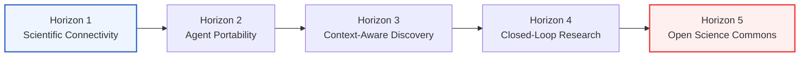
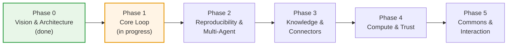

# Open Science Roadmap

> Open Science is building an open, model-agnostic, self-hostable implementation of the "AI research workbench" category — the same category of tool that closed, single-vendor products in this space have demonstrated, decomposed into open, independently replaceable layers. This document is the living map of where that project is headed and how far it has gotten. For the full functional specification behind each item here, see [`docs/PRD.md`](docs/PRD.md).

Status legend: ✅ core target is shipping · 🟡 materially incomplete · ⬜ not started. A green capability can continue to improve; it means the target named in that row is available today, not that every longer-term extension is finished.

---

## Table of Contents

- [Long-Term Vision: Five Horizons](#long-term-vision-five-horizons)
- [Where We Are Today](#where-we-are-today)
- [Capability Map](#capability-map)
- [Delivery Phases](#delivery-phases)
- [Boundaries & Non-Goals](#boundaries--non-goals)
- [How to Contribute to This Roadmap](#how-to-contribute-to-this-roadmap)

---

## Long-Term Vision: Five Horizons

The delivery phases below are the concrete, near-term execution plan. Underneath them sits a longer arc — five horizons that describe what "done" looks like for AI-native science as a field, not just for this codebase. Each delivery phase is a step along this arc; none of them are meant to be the final state.

1. **Scientific Connectivity.** Ship a foundational access client that registers scientific data sources and life-science tooling as directly callable agent capabilities — turning scattered, siloed scientific databases into infrastructure an agent can reach immediately, instead of a dozen browser tabs a human has to operate by hand.
2. **Agent Portability.** Make scientific intelligence portable across models, frameworks, and research environments, so capability follows the scientist rather than being locked to one vendor's interface. A skill, a workflow, or an analysis a lab builds should keep working when it moves to a different model, a different orchestration framework, or a different institution's infrastructure.
3. **Context-Aware Discovery.** Move from tool _abundance_ to tool _intelligence_: an agent facing hundreds of available capabilities should discover, select, and compose only the ones a given task, its evidence, and the surrounding research context actually call for — not enumerate everything it could theoretically use.
4. **Closed-Loop Research.** Connect literature, computation, simulation, notebooks, and verification into a single traceable discovery loop, one where a hypothesis can be generated, challenged, executed, and refined without leaving the loop or losing its provenance at each handoff.
5. **Open Science Commons.** Arrive at a shared intelligence layer for AI-native science — an open infrastructure where protocols, agents, datasets, workflows, and governance live in the open and compose across labs, models, and platforms, so reproducible discovery isn't bottlenecked on any single one of them.

## Where We Are Today

Open Science is an **early preview with a working research loop**, not a concept demo. Horizon 1's connectivity foundation is usable today, Horizon 2's portability work is underway across model providers, agent frameworks, skills, and compute environments, and v0.8.0 establishes the first concrete Horizon 4 traceability layer: persistent message branches for alternative research paths plus immutable artifact versions tied to inspectable production evidence. v0.9.0 adds personal specialist agents with scoped capabilities, durable scoped permission management, and portable conversation and artifact export — bringing the first slices of Phase 3's "specialist roles" and Phase 4's "scoped permissions" into early form. v0.9.1 extends the workspace with mobile remote access through Remote.It pairing, conversational specialist customization driven by the agent via a name-first control-plane SDK, and message timing metadata in the transcript. v0.9.2 adds immediate specialist handoff so switching agents takes effect on the in-flight turn, completed-turn agent framework and model identification in the usage popover, context-usage persistence across restarts, and Windows renderer crash recovery. v0.10.0 adds a project-scoped command palette, code syntax highlighting in previews and notebook cells, read-only installed-package inventories per runtime environment, conversational skill imports from GitHub URLs, direct file preview beside the session, and Bailian as a built-in model provider, while hardening session persistence, Windows update feedback, cross-platform path handling, and the renderer transport contract. v0.10.1 adds branching a conversation into a new session, GitHub skill search by keyword, specialist package import/export with contribution channels, and session-age metadata in the artifact list, while keeping oversized data files out of model context, hardening branch replay, reviewer correction provenance, and Codex prompt-runtime ownership, and introducing a provider turn-adapter interface and a module-first application-command architecture that routes IPC through typed, independently testable owners. v0.11.0 adds review-gated session plans with durable execution contracts, hot-switching ACP models and providers without reconnecting the agent process, agent-aware context replay that respects each framework's context path, prompt history navigation in the composer, session link favicons, and a settings keyboard shortcut, while hardening Windows auto-update and local RPC through named pipes, logger data redaction, artifact provenance binding to the prompt runtime segment, notebook process-group cleanup, and production dependency security. v0.11.1 adds on-demand artifact code reconstruction through an isolated one-shot model session, live permission profile changes during a running turn, project and session archiving with undo and confirmed permanent deletion, MCP connector OAuth sign-in and portable configuration import/export, tool-activity elapsed time in the transcript, persistent plan call records, and branded loading indicators, while hardening Windows runtime access-violation recovery, session-plan turn completion decoupling, and cross-platform release certification. v0.11.2 adds kernel image-output previews for R and Python notebooks, an offline detection indicator with a Network status panel, Task API run-progress liveness with explicit run cancellation, isolated unavailable custom MCP server discovery, artifact finalization proof-failure diagnostics, and Windows updater certification stabilization, while continuing the artifact-provenance, session-persistence, project-files, uploads, and session-store ownership refactor. v0.12.0 adds a cross-surface notification message center with durable read state, a structured agent clarification workflow for multi-question requests, authenticated GitHub skill imports, live session status on the Home dashboard, session-resume continuation for interrupted turns without duplicate messages, and notebook output-artifact separation, while continuing the workspace-runtime, project-files-view, session-persistence, and transport ownership refactor.

That is an audit milestone, not the finish line for reproducibility. Open Science can preserve what it can prove about a result and make missing evidence explicit; it cannot yet reconstruct every environment, replay a complete session, or guarantee that rerunning an analysis yields identical output. The roadmap now separates those two promises deliberately:

- **Traceability, shipping:** identify an exact artifact version and inspect its available code, execution, inputs, environment inventory, conversation context, and review evidence.
- **Deterministic reproduction, still open:** restore a portable environment, replay the full producing state, and reconstruct the result with a defined equivalence guarantee.

**Working today:**

- ✅ Agent runtime with a full plan/execute/tool-call loop, wrapped over the Agent Client Protocol (ACP), on a pluggable agent-framework backend — Claude Code by default, with OpenCode and Codex selectable as alternative implementations behind the same runtime (Codex drives OpenAI Responses providers directly and Chat-Completions providers through a loopback translation gateway, and can authenticate with an existing ChatGPT/Codex subscription login instead of an API key); each backend's app-managed runtime can be installed, switched, and uninstalled from Settings cards; the runtime also supports review-gated session plans — durable, user-reviewable execution contracts that persist across restarts and context compaction, require explicit continuation before an approved unfinished plan can resume, and block turn completion while required steps remain
- ✅ Multi-provider model configuration with per-session selection — built-in vendors (OpenAI, Anthropic (Claude), Grok (xAI), DeepSeek, Zhipu AI (GLM), GLM Coding Plan, Kimi (Moonshot), Kimi For Coding, MiniMax, StepFun, StepFun Step Plan, Xiaomi MIMO, SenseNova, Volcengine Ark, Bailian (Alibaba Cloud) with a dedicated Bailian for Plan subscription endpoint, and the OpenRouter aggregation gateway) plus custom gateways (whose default API format is derived from the active agent framework) and Claude / Codex subscription logins (Claude via shared browser login or an isolated `claude setup-token` flow, Codex via the existing ChatGPT/Codex subscription), with live catalog refresh, mid-run switching that applies compatible model and provider changes to the running session without reconnecting the agent process, per-model multimodal metadata, and a combined composer picker for model and supported reasoning effort; Anthropic-compatible endpoints on any backend, plus OpenAI-compatible (`/v1/chat/completions`) and Responses (`/v1/responses`) endpoints when an OpenAI-speaking backend is selected
- ✅ An opt-in specialist reviewer that audits a completed turn in a clean, tool-restricted context — tracing the agent's claims against the real transcript, execution log, and artifacts, emitting structured pass/warn/fail findings, and running a bounded, user-abortable fix loop to correct flagged findings
- ✅ Personal specialist agent profiles — define reusable agents with their own name, avatar, persona, and scoped capabilities (skills/connectors whitelist or full access), bind one per session so identity applies from the first turn, hot-switch specialists mid-conversation with immediate in-flight-turn handoff behind a reconfigure barrier that fails closed, and manage specialists conversationally through the agent via a name-first control-plane SDK and a `/customize` workflow
- ✅ Electron + React + TypeScript desktop shell with a shadcn-based design system, a system-tray presence with single-instance locking, awaited cleanup of agent processes on quit, a dark-mode theme toggle applied synchronously before first render, and collapsible side panels for flexible workspace layout
- ✅ Parallel multi-session workspace with typed tool-activity visualization (diffs, code blocks, web search rows) grouped under agent-declared purpose titles, editable completed prompts that fork into selectable message branches while preserving the original path, a live context-usage indicator with category-level estimates and on-demand native context compaction (automatically triggered at 90% for Claude Code and OpenCode, while Codex owns automatic compaction against its configured 95% effective context window; manual compaction is available from the indicator popover; usage persists across restarts), per-turn token usage footers (input, cache, output) under the final agent message, message timing metadata with sent/completed timestamps and elapsed-time plus usage popovers, completed-turn agent framework and model identification, a whole-window find bar (`Cmd/Ctrl+F`), a project-scoped command palette (`Cmd/Ctrl+K`), and session pinning to keep key sessions at the top of the sidebar
- ✅ Project layer with per-project, per-file session storage, a durable conversation graph that retains branch-specific messages and activity across restarts, migration from the legacy single-file format, and a home page
- ✅ A persistent notebook execution runtime — warm Python, R, and REPL control-plane kernels routed per session binding, plus stateless shell commands executed per call in the session workspace, with cross-kernel handoff through a shared workspace channel, app-managed conda environments with offline provisioning plus bring-your-own Python and R interpreter discovery, durable and inspectable run history, a read-only installed-package inventory per runtime environment, and crash-recoverable journaling for environment and package mutations
- ✅ Immutable, session-scoped artifact versioning with checksummed content, producer code, execution history, exact input references, environment inventory, producing message-branch context, version-scoped reviewer evidence, crash recovery, and migration-aware storage validation; files remain indexed across branch switches and evidence that cannot be proven is surfaced as unavailable
- ✅ Rich in-app file previews (CSV, FASTA, HTML, PDF, image with zoom and pan including TIFF, JSON, Markdown, plain text, source code with syntax highlighting, notebook cells, and Office documents — DOCX, XLSX, PPTX — rendered in isolated processes), with responsive multi-tab navigation, readable long names, a searchable project file library with grid/list views, a large expand modal, and a split-view preview beside the session, and a full-screen preview mode from both the preview panel and the Files tab
- ✅ Attachment uploads (up to 10 GB per file via streaming upload) and a permission-approval UI for tool calls, with per-conversation approval profiles (remembered by tool category, with per-session grants visible) and durable scoped permission management (global, project, and session-scoped allow grants with filtering, per-row and family revoke, and an Undo stack)
- ✅ File-based agent skills — create, edit, and import (zip) skills, pull them into a session through a `/` selector in the composer, with materialized skill directories kept read-only; import skills already installed in global agent directories with candidate preview; let the agent request a package import from a session attachment or a public GitHub URL behind an app-owned confirmation step; and optionally authenticate GitHub requests with a personal access token for higher rate limits
- ✅ 24 built-in connectors — 23 life-science data connectors expanded and aligned to their upstream MCP servers into 200+ callable tools, plus an offline OpenChemLib molecule viewer — plus custom MCP servers (stdio/HTTP/SSE), callable from agent sessions behind the permission gate
- ✅ Packaged desktop installers for macOS (Apple Silicon + Intel — Developer ID signed and notarized by Apple), Windows, and Linux, plus a nightly build channel off `main`
- ✅ An optional localhost web UI and headless backend mode — serve the same renderer to a browser bound to `127.0.0.1` (with external project/session lifecycle kept in sync and shareable via deep links), run the backend/tray/agent/notebook without an Electron window, and drive that headless service from a bundled `open-science` CLI plus a zero-dependency Node.js task SDK (installable to PATH from the packaged app, no separate Node.js needed) that reuse the same daemon, projects, sessions, credentials, and permissions as the desktop app; mobile remote access is available through Remote.It pairing with six-digit Open Science authentication and revocable per-browser trust
- ✅ Remote SSH compute hosts — register a remote machine over SSH as an execution target for notebook runs, alongside the local kernels, so heavier work can run off the laptop; harvested results follow the active data-storage location
- ✅ Desktop notifications on task completion and failure plus durable unread conversation badges and native attention on blocking approval requests, a cross-surface notification message center with a shared inbox, durable read state, authorization action state, and structured project/session navigation targets, and live session status with running, waiting-on-you, and newly completed cards on the Home dashboard, so a long-running run doesn't need the window in the foreground to report its outcome
- ✅ Notebook sessions exportable as `.ipynb` — per-tab export plus a download-all, validated against the nbformat spec; whole-conversation export as Markdown and PDF with a normalized public export model, and selective session-artifact downloads with collision-safe batch saving
- ✅ In-place background auto-update (electron-updater) on macOS, Windows, and Linux, with an About panel and condensed release-note highlights, and a manual-download fallback when auto-update can't complete
- ✅ A configurable data-storage location — relocate large data (artifacts, notebooks, uploads) to another folder with a copy-verify-restart migration, adopt an existing folder, or return to default, plus a legacy-install migration prompt and a missing-root recovery path
- ✅ A read-only session notebook viewer; ACP reconnect-and-continue (Resume) on an abnormal disconnect that continues an interrupted turn without duplicate messages; and a structured agent clarification workflow that presents multi-question requests as blocking choice cards with previous/next navigation, custom answers, Skip, and Let the agent decide
- ✅ A guided first-run onboarding wizard, split into focused environment, agent, provider, notebook, and location steps, that checks and provisions the runtime environment automatically (app-managed Claude install with no Node/npm required), with background health checks and environment repair moved into Settings

**Still open — several foundations are already shipping, but these broader targets remain:**

- 🟡 A backend-independent universal model gateway; multi-provider selection ships today (see below), and the OpenCode and Codex backends now reach OpenAI-compatible and Responses endpoints alongside Anthropic-compatible ones — but provider choice is still gated on the selected framework's endpoint compatibility, and unified per-agent routing across arbitrary native protocols is not yet built
- 🟡 Deterministic provenance replay — immutable artifact versions and audit evidence ship today, while portable environment locks, full-fidelity Session replay, and one-click reconstruction remain future work
- 🟡 Reproducible environment portability — managed Python/R environments, named-environment lifecycle, bring-your-own Python/R interpreters, per-session binding, offline provisioning, and immutable environment inventory evidence ship today; portable lock export/restore is not built yet
- ⬜ A public skills commons — versioned, forkable, shareable skills with lexical discovery; local file-based skill management ships today (see above), the shared commons does not
- 🟡 Remote compute and async tasks — remote SSH compute hosts and desktop task-completion/failure notifications ship today (see above); Slurm/cloud-GPU submission and parallel sub-agent fan-out are not built yet
- 🟡 Security hardening beyond scoped permissions — durable scoped grants, OS-backed encrypted secret storage, and workspace containment for app-owned file operations ship today; agent network sandboxing, user-configurable directory grants, and centralized credential inventory and rotation are not built yet
- 🟡 A shared specialist commons — reusable personal specialist agent profiles with scoped capabilities ship today (see above); cross-machine discovery, forking, and sharing are not built yet
- ⬜ Spatial annotations, editable scientific viewers, and automatic skill-aware context discovery

## Capability Map

The product is organized into cooperating layers (see [`docs/PRD.md`](docs/PRD.md) for the full architecture). This table tracks each layer's target capability against what exists in the codebase today.

| Layer                              | Target capability                                                                                                | Current state                                                                                                                                                                                                                                                                                                                                                                                                                                                                                                                                                                                                                                                                                                                                                                                                                                                                                                                                                                                                                                                                                                                                                                                                                                                                   | Status |
| ---------------------------------- | ---------------------------------------------------------------------------------------------------------------- | ------------------------------------------------------------------------------------------------------------------------------------------------------------------------------------------------------------------------------------------------------------------------------------------------------------------------------------------------------------------------------------------------------------------------------------------------------------------------------------------------------------------------------------------------------------------------------------------------------------------------------------------------------------------------------------------------------------------------------------------------------------------------------------------------------------------------------------------------------------------------------------------------------------------------------------------------------------------------------------------------------------------------------------------------------------------------------------------------------------------------------------------------------------------------------------------------------------------------------------------------------------------------------- | ------ |
| **Agent Harness & Shell**          | Planning/execution/reflection loop, multi-session UI, skill discovery, async notifications                       | Agent loop via ACP on a pluggable framework backend (Claude Code default, OpenCode and Codex alternatives), parallel session mounting, selectable message branches, typed tool-activity visualization with per-tool elapsed time, explicit `/` skill discovery, opt-in specialist review, review-gated session plans with durable execution contracts and persistent plan call records, live permission profile changes during a running turn, desktop task-completion/failure notifications, durable unread conversation badges and native attention on blocking approvals, a cross-surface notification message center with durable read state, structured agent clarification cards for multi-question requests, live session status with running and waiting-on-you cards on the Home dashboard, category-level context-usage estimates with restart persistence, per-turn token usage footers, message timing metadata with elapsed-time and usage popovers, completed-turn agent framework and model identification, native context compaction, personal specialist profiles with scoped capabilities and conversational customization and immediate in-flight handoff, collapsible side panels, a whole-window find bar, a project-scoped command palette, and dark mode | ✅     |
| **Model Layer**                    | Pluggable gateway across model vendors and locally-hosted models, per-agent routing                              | Multi-provider config with per-session selection (built-in vendors — OpenAI, Anthropic (Claude), Grok (xAI), DeepSeek, Zhipu AI (GLM), GLM Coding Plan, Kimi (Moonshot), Kimi For Coding, MiniMax, StepFun, StepFun Step Plan, Xiaomi MIMO, SenseNova, Volcengine Ark, Bailian (Alibaba Cloud) with a dedicated Bailian for Plan subscription endpoint, and the OpenRouter aggregation gateway — plus custom gateways whose default API format is derived from the active framework and Claude / Codex subscription logins), with per-model multimodal metadata, a combined model/reasoning-effort composer picker, and live hot-switching of compatible models and providers without reconnecting the agent process; provider choice is still gated on framework/endpoint compatibility and there is no unified per-agent routing yet                                                                                                                                                                                                                                                                                                                                                                                                                                          | 🟡     |
| **Project & Session Organization** | Durable per-project workspaces, session history, fast resume                                                     | Project CRUD with per-project/per-file session storage with migration, persistent alternative message branches, a home page with recents, whole-conversation export as Markdown and PDF, selective session-artifact downloads, and reversible project and session archiving with undo and confirmed permanent deletion                                                                                                                                                                                                                                                                                                                                                                                                                                                                                                                                                                                                                                                                                                                                                                                                                                                                                                                                                          | ✅     |
| **Multi-Kernel Execution Engine**  | Interchangeable Python / R runtimes and shell execution with cross-kernel handoff                                | Warm Python, R, and REPL control-plane kernels routed per session binding, plus stateless shell commands executed per call in the session workspace, with cross-kernel handoff through a shared workspace channel, durable run history, and inline image-output previews for captured figures and saved plots from R and Python runs; environment and package mutations use crash-recoverable operation journaling                                                                                                                                                                                                                                                                                                                                                                                                                                                                                                                                                                                                                                                                                                                                                                                                                                                              | ✅     |
| **Environment Management**         | Create, switch, snapshot, and register reproducible compute environments                                         | App-managed conda environments with version-pinned, SHA256-verified offline provisioning, named-environment create/remove, bring-your-own Python/R interpreter discovery and registration, and per-session binding/selection; provenance records immutable observed inventories, but package management for external R runtimes remains manual and portable lock export/restore is not built yet                                                                                                                                                                                                                                                                                                                                                                                                                                                                                                                                                                                                                                                                                                                                                                                                                                                                                | 🟡     |
| **Artifacts & Provenance**         | Versioned outputs with full lineage (code, logs, dependencies, environment, conversation)                        | Immutable, checksummed, session-scoped artifact versions retain available producer code, execution history, exact input references, environment inventory, producing message-branch context, and version-scoped reviewer evidence, with explicit unavailable states, version navigation, direct links between related evidence, and on-demand LLM-driven code reconstruction from the immutable execution log through an isolated one-shot session                                                                                                                                                                                                                                                                                                                                                                                                                                                                                                                                                                                                                                                                                                                                                                                                                              | ✅     |
| **File Preview & Viewers**         | Native, in-app rendering of scientific artifacts                                                                 | Responsive multi-tab renderers for CSV, FASTA, HTML, PDF, images (including TIFF, with zoom and pan), JSON, Markdown, text, source code with syntax highlighting, Office documents, Notebook history, and molecular structures/reactions; includes a project file library, readable long names, isolated Office rendering, split-view preview beside the session, and full-screen preview                                                                                                                                                                                                                                                                                                                                                                                                                                                                                                                                                                                                                                                                                                                                                                                                                                                                                       | ✅     |
| **Skills Commons**                 | Versioned, forkable, file-based skills with lexical discovery and explicit loading                               | File-based skill management (create/edit/import, `/`-selector discovery in the composer, read-only materialized dirs), with per-skill version stamps driving incremental re-materialization; conversational skill imports from public GitHub URLs through an app-owned confirmation step, with optional authenticated access for higher rate limits; user-facing version pinning and a shared public commons for discovery/reuse are not built yet                                                                                                                                                                                                                                                                                                                                                                                                                                                                                                                                                                                                                                                                                                                                                                                                                              | 🟡     |
| **Specialist Commons**             | Reusable, forkable specialist profiles that bundle persona, skills, connectors, and permissions                  | Personal specialist agent profiles can be created and reused with a name, avatar, persona, and scoped skills/connectors or full access; one profile can be bound per session and hot-switched with immediate in-flight-turn handoff behind a fail-closed reconfigure barrier; specialists can also be managed conversationally through the agent via a name-first control-plane SDK and a `/customize` workflow, but cross-machine discovery, forking, and sharing are not built yet                                                                                                                                                                                                                                                                                                                                                                                                                                                                                                                                                                                                                                                                                                                                                                                            | 🟡     |
| **Data & MCP Connectors**          | Pre-built connectors to open scientific databases, callable from an isolated execution context                   | 24 built-in connectors — 23 life-science data connectors (literature, genes/proteins, genomes, variants, structures, clinical, chemistry, expression) expanded to 200+ tools aligned with their upstream MCP servers, plus an offline OpenChemLib molecule viewer — plus custom MCP server support (stdio/HTTP/SSE) with standard remote OAuth sign-in and portable configuration import/export, all callable behind the permission gate                                                                                                                                                                                                                                                                                                                                                                                                                                                                                                                                                                                                                                                                                                                                                                                                                                        | ✅     |
| **Remote Compute & Async Tasks**   | Job submission to HPC/cloud, async completion notifications, parallel sub-agent fan-out                          | Remote SSH compute hosts registrable as notebook execution targets, harvested results routed through the active data-storage location, and desktop notifications on task completion/failure; Slurm/cloud-GPU submission and parallel sub-agent fan-out are not built yet                                                                                                                                                                                                                                                                                                                                                                                                                                                                                                                                                                                                                                                                                                                                                                                                                                                                                                                                                                                                        | 🟡     |
| **Security & Permissions**         | Scoped permission gates, network allowlisting, directory-level file access control, managed credential lifecycle | Tool-call permission gate with an approval UI, per-conversation approval profiles, durable scoped allow grants (global, project, session) with filtering, family revoke, and an Undo stack, live permission profile changes during a running turn, OS-backed encrypted secret storage, workspace containment for app-owned file operations, and an opt-in reviewer with a bounded fix loop; agent network sandboxing, user-configurable directory grants, and centralized credential inventory/rotation remain open                                                                                                                                                                                                                                                                                                                                                                                                                                                                                                                                                                                                                                                                                                                                                             | 🟡     |
| **Context Management**             | Layered system rules, attachment ingestion, skill-aware context injection, history compaction                    | Layered application, connector, specialist, and skill guidance; file/attachment upload wired into prompts (with large-file streaming up to 10 GB); explicit `/`-selector skill injection; category-level context-usage estimates; and native manual and automatic compaction across Claude Code, OpenCode, and Codex                                                                                                                                                                                                                                                                                                                                                                                                                                                                                                                                                                                                                                                                                                                                                                                                                                                                                                                                                            | ✅     |
| **Interactive Annotations**        | Spatially-anchored feedback on images, PDFs, text, and HTML surfaces                                             | Not implemented                                                                                                                                                                                                                                                                                                                                                                                                                                                                                                                                                                                                                                                                                                                                                                                                                                                                                                                                                                                                                                                                                                                                                                                                                                                                 | ⬜     |

## Delivery Phases

- **Phase 0 — Vision & Architecture (done).** This roadmap, the [PRD](docs/PRD.md), the design system, and initial community formation.
- **Phase 1 — Core Loop (in progress).** Desktop shell, single-agent runtime, project/session persistence with editable message branching, a persistent multi-kernel notebook runtime, versioned artifact storage, rich in-app previews, file-based agent skills, built-in life-science data connectors plus custom MCP servers, packaged installers for macOS/Windows/Linux (macOS signed and notarized) with a configurable data-storage location, a guided first-run onboarding wizard, and in-place background auto-update — all shipping today. Multi-provider model configuration with per-session model and reasoning-effort selection also ships now — across Anthropic-compatible endpoints on any backend, and OpenAI-compatible / Responses endpoints when the OpenCode or Codex agent-framework backend is selected. A first CLI/browser entry point has also landed: an optional localhost web UI (with synced external project/session lifecycle and deep links), a headless backend mode, an `open-science` CLI that runs the backend as a background daemon, a zero-dependency Node.js task SDK over the same daemon, and mobile remote access through Remote.It pairing (v0.9.1). Still open in this phase: a backend-independent universal model gateway (unified routing across arbitrary native protocols, independent of the selected framework) and a broader scriptable/embeddable SDK surface.
- **Phase 2 — Reproducibility & Multi-Agent.** The first traceability slice now ships: immutable artifact versions, production evidence, warm Python/R/REPL kernels, and app-managed conda environments. The remaining target is stronger than auditability — deterministic reconstruction, portable environment lock export/restore, full-fidelity session replay, and specialist sub-agents alongside the generalist coordinator. This is the project's core differentiation from a generic coding agent and the highest-priority phase for contributors who want to make the biggest structural dent.
- **Phase 3 — Knowledge & Connectors.** A public skills commons with versioned, forkable skills and lexical discovery; savable "specialist" roles (instructions + skills + connectors + permissions bundled together). The connector layer — the built-in life-science connectors plus custom MCP servers — already shipped in Phase 1, and personal specialist agent profiles with scoped capabilities now ship in v0.9.0 and conversational specialist customization via the agent control-plane SDK in v0.9.1 as the first concrete specialist-role slices; what remains in this phase is the shared public skills commons and cross-machine specialist sharing.
- **Phase 4 — Compute & Trust.** Remote compute as a first-class primitive (SSH/Slurm/cloud GPU) with async job notifications and sub-agent fan-out; the full security stack (scoped permissions, network allowlisting, directory-level file sandboxing, and managed credential lifecycle). Several of this phase's primitives have already begun landing in early form during Phase 1: remote SSH compute hosts as notebook execution targets and desktop notifications on task completion/failure (so what remains here on the compute side is Slurm/cloud-GPU submission and sub-agent fan-out); an opt-in reviewer/verifier that audits a turn against its own record with a bounded fix loop; a pluggable agent-framework backend (Claude Code, OpenCode, and Codex) so the runtime isn't locked to one agent implementation; OS-backed encrypted secret storage; and scoped permission management (global, project, and session-scoped allow grants with filtering, family revoke, and Undo) landing in v0.9.0 as the first concrete trust-stack slice. Deepening these — richer verification rubrics, additional framework backends, and the remaining security stack (agent network sandboxing, user-configurable directory grants, and centralized credential inventory/rotation) — continues here.
- **Phase 5 — Commons & Interaction.** A public skills marketplace, an optional hosted offering, and institutional governance/audit features; spatially-anchored annotations; editable scientific viewers; automatic skill-aware context discovery and injection.

Phase kickoffs and priority calls get announced on **[X](https://x.com/aipoch_ai)** first and debated in **[Discord](https://discord.gg/85dKfuGM9)** before they land here — this roadmap is a living hypothesis, not a fixed spec, and each phase becomes tracked issues/RFCs as contributors join.

## Boundaries & Non-Goals

Some limits are deliberate, not oversights, and we'd rather say so than let the roadmap imply otherwise:

- **Single-researcher focused.** This is not a real-time, multi-person collaborative editor. Team workflows go through export / share / import, not live co-editing.
- **Computation and outputs, not research semantics.** The system models code, data, and artifacts — it does not bake in "hypothesis / experiment / conclusion" as first-class structured entities.
- **Reproducibility is layered and best-effort.** Provenance captures immutable artifact bytes and available code, logs, inputs, environment inventory, message context, and review evidence for audit. Environment inventory is not a solver lock, retained messages omit binary media, and unavailable producer evidence is not inferred. Exact skill-version pinning, portable environment restoration, and full Session replay remain known gaps.
- **Does not replace domain-expert judgment.** Statistical validity, batch-effect analysis, and data-leakage risk are still calls a human researcher has to make. Open Science lowers the cost of _executing_ and _recording_ research, not the cost of _judging_ it.
- **Not a proxy or reskin of any closed-source product.** Open Science shares no code with any single vendor's client and is not designed to route around a vendor's billing or terms of service — it's an independent, from-scratch implementation of the same category of tool, built to be self-hosted and inspected from the ground up.

## How to Contribute to This Roadmap

Pick anything marked ⬜ or 🟡 above, open an [Issue](https://github.com/aipoch/open-science/issues) describing your approach, and start a [Discussion](https://github.com/aipoch/open-science/discussions) if you want to debate the design before writing code. See [Get Involved](README.md#get-involved) in the README for the full picture.

---

_This roadmap reflects the current codebase and design docs, and is updated as the project evolves._
