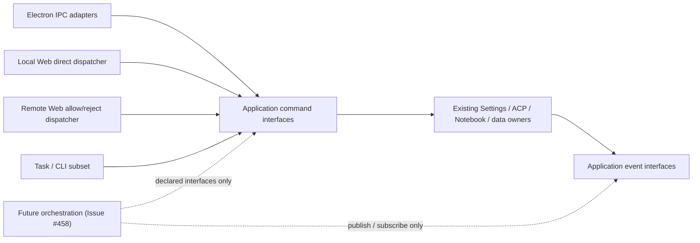

# Open-Science — Product Requirements Document

> Status: living document, tracks the shipped product plus near-term scope. For the long-range vision and phase-by-phase delivery plan, see [`ROADMAP.md`](../ROADMAP.md). For the visual/interaction spec, see [`design.md`](../design.md).

## 1. Summary

**Open-Science is an open-source, model-agnostic AI workbench for scientific discovery.** It runs as a self-hosted desktop application that pairs a planning-and-execution agent with a persistent, managed compute runtime and durable project/session storage — so a researcher can hand off a real data-analysis or literature task to an agent and get back not just an answer, but the code, execution record, and artifacts that produced it.

The project exists because the clearest current articulation of this product category is closed-source and single-vendor: gated by billing region, subscription tier, and one company's model and infrastructure choices. Open-Science is an independent, from-scratch implementation of the same category of tool — not a proxy, wrapper, or jailbreak of any existing closed product — built so labs can choose compatible models and infrastructure on their own terms.

## 2. Problem Statement

A working researcher's day is a tour of disconnected tools: a reference manager, a notebook kernel, an SSH session into a cluster, browser tabs for database web forms, a stats package, and a manuscript editor that knows nothing about any of the above. None of these tools share state. None of them remember what was done yesterday. Reproducing an analysis from three months ago is often harder than running it the first time.

This shows up as four structural pains:

1. **Results aren't reproducible.** Code, data, and environment are scattered across machines, tracked (if at all) by manual habit. Nobody can reliably answer "which script, which parameters, which dependency versions produced this exact figure?"
2. **Constant tool-switching.** A typical workflow bounces between a scripting language, a stats package, shell access to a cluster, and literature search — every switch loses context and forces manual data movement.
3. **Fragmented compute.** A laptop, a lab server, an HPC cluster, and cloud GPUs are all valid places to run a job, but choosing and coordinating between them is manual, and data gets shuttled around unnecessarily.
4. **Audit is an afterthought.** In regulated research settings, reconstructing "who generated what, with what code, at what time" usually means reading logs after the fact rather than relying on something the system tracked by default.

## 3. Goals

- Give a researcher an agent that can **plan, execute, and revise** multi-step analysis and research tasks, not just suggest code for a human to run.
- Make every artifact the agent produces **traceable back to the code, data, and environment** that generated it.
- Keep the system **model-agnostic and self-hostable** by design, so no single vendor's pricing, billing region, or infrastructure choices gate access to it.
- Ship a **desktop-first experience** today, with the underlying orchestration core designed to support additional interfaces (CLI/SDK, web) later without a rewrite.
- Be honest about maturity: this PRD documents what exists, what's partially built, and what's aspirational — see the [Roadmap](../ROADMAP.md) for the phase-by-phase breakdown.

## 4. Non-Goals

- **Not a real-time multi-user collaborative editor.** Team workflows happen through export/share/import, not simultaneous co-editing of one session.
- **Not a replacement for domain-expert judgment.** Statistical validity, batch-effect analysis, and data-leakage risk remain calls the researcher makes; the system reduces the cost of _executing_ and _recording_ work, not the cost of _judging_ it.
- **Not modeling research semantics.** The system's structured objects are computations and artifacts, not first-class "hypothesis / experiment / conclusion" entities.
- **Not a proxy, reskin, or unofficial client of any closed-source product.** Open-Science shares no code with any single vendor's client software.

## 5. Target Users

- **Individual researchers and small labs** running data-heavy analysis (genomics, proteomics, structural biology, cheminformatics, and beyond) who want an agent that can execute, not just chat.
- **Institutions that cannot use a cloud-hosted, subscription-gated product** — due to data residency, billing region, or data-handling policy (e.g. PHI, unpublished data) — and need to self-host on their own infrastructure.
- **Contributors and toolmakers** who want to extend the system with new connectors, kernels, or skills rather than being limited to a closed plugin marketplace.

## 6. Product Principles

These are the constraints the project treats as non-negotiable as it grows (see the founding vision in the [README](../README.md#design-principles) for full rationale):

- **Access is a right, not a privilege.** No plan tier, billing-region allowlist, or approval queue stands between a researcher and the software.
- **Model-agnostic core.** The agent runtime should ultimately talk to LLMs through a pluggable gateway — Claude, GPT, Gemini, DeepSeek, Qwen, or a locally-hosted open-weight model are all first-class citizens, not a hardcoded dependency. Today's product has pluggable Claude Code, OpenCode, and Codex backends, while provider compatibility still depends on the selected backend's supported API protocols — see [§8](#8-current-architecture-what-is-actually-implemented).
- **Local-first, data-sovereign by default.** Self-hosting is the default deployment target, not an enterprise upsell.
- **Reproducibility is a system property, not a discipline.** Every artifact should eventually carry the code, environment, and data lineage that produced it, generated automatically rather than maintained by hand.
- **Skills should be plain files, not opaque plugins.** Versioned, human-readable, and forkable — auditable by the person trusting them with their analysis.
- **Human-in-the-loop by construction.** New data sources, compute budgets, and external credentials require explicit, scoped approval; autonomy is opt-in, never ambient.
- **Composability over monolith.** Small, swappable services (model gateway, skill runtime, compute broker, artifact renderer) instead of one inseparable black box.
- **Trust is verified, not assumed.** Where the system makes a claim, that claim's basis (citation, computation, statistical method) should be checkable — ideally by another agent, not just by the researcher re-deriving it by hand.

## 7. Core User Journeys

1. **Start a project, run an analysis.** A researcher creates a project, opens a session, and asks the agent to load data, run a script, and produce a figure. The agent plans steps, executes them in the notebook kernel, and reports back with the resulting artifact — all without the researcher hand-writing the glue code.
2. **Resume where you left off.** The researcher closes the app and comes back days later; the home page shows their projects and five most recent sessions, and reopening one restores full conversation and execution history.
3. **Review what the agent did before trusting it.** Every tool call the agent makes is shown as a typed activity row (code diff, code block, web search, etc.), and higher-risk actions pause for explicit approval before running.
4. **Preview outputs without leaving the app.** Generated CSVs, images, PDFs, Office documents, HTML reports, FASTA files, JSON, Markdown, molecular structures/reactions, and Notebook history render natively in-app instead of requiring the researcher to open them in a separate tool.
5. **Organize work by project.** Multiple projects keep sessions, artifacts, and notebook workspaces isolated from each other, so a researcher running several concurrent lines of work doesn't have them bleed into one shared history.

## 8. Current Architecture (What Is Actually Implemented)

Open-Science today is an Electron + React + TypeScript desktop application built around four cooperating layers:

| Layer                      | Responsibility                                                            | Current implementation                                                                                                                                                                                                                          |
| -------------------------- | ------------------------------------------------------------------------- | ----------------------------------------------------------------------------------------------------------------------------------------------------------------------------------------------------------------------------------------------- |
| **Interface**              | Desktop shell, workspace UI, home page                                    | Electron main/renderer split; React + TypeScript; shadcn/Radix design system (see [`design.md`](../design.md))                                                                                                                                  |
| **Agent Harness**          | Plan → execute → reflect loop, tool-call visualization, permission gating | Agent runtime wrapped over the Agent Client Protocol (ACP), with Claude Code, OpenCode, Codex, and CodeBuddy selectable behind the same runtime; typed tool-activity rows; scoped permission gates; specialist profiles; and an opt-in reviewer |
| **Execution / Data Plane** | Managed code execution, artifact generation                               | Persistent Python, R, and REPL control-plane kernels plus stateless shell execution (`src/main/notebook/`) with durable, inspectable run history, app-managed environments, and remote SSH execution targets                                    |
| **Persistence**            | Project/session storage, artifact storage                                 | Prisma + SQLite for project and provenance metadata; per-project, per-file session storage on disk (`src/main/session-persistence/`); immutable artifact versions and evidence sidecars under app-managed storage (`src/main/artifacts/`)       |

### Runtime State Ownership and Surface Boundaries

The main process has one composition root (`src/main/ipc.ts`). It constructs state owners once,
installs transport adapters after ownership is established, and disposes modules in reverse order.
The transport-neutral application command router and application event hub expose capabilities; they
do not become alternate state stores.

| Owner boundary                  | State and lifecycle responsibility                                                                                                                                                                                                                                                                                                                                                                |
| ------------------------------- | ------------------------------------------------------------------------------------------------------------------------------------------------------------------------------------------------------------------------------------------------------------------------------------------------------------------------------------------------------------------------------------------------- |
| Settings modules                | Persist provider, runtime, skill, connector, appearance, and related configuration. Active provider/model/effort are defaults for new Sessions; changing those defaults does not mutate existing Sessions. Runtime consumers resolve fresh credentials/configuration when a generation starts; they do not retain Settings mutable state.                                                         |
| ACP runtime coordinator         | Own runtime generations and stable application Session identity across reconnect/reset. Each create/resume carries the Session's explicit framework/provider/model/effort target; compatible targets reuse a generation. A provider protocol Session id belongs to its generation and may be replaced; Codex fresh-session adoption, transcript replay, context reset, and cleanup remain intact. |
| ACP runtime and Session owners  | Own one generation's live processes, prompts, permissions, resources, and per-turn terminal results. Context-window aggregation stays with the context-usage tracker; terminal timestamp, token usage, and model-turn count stay with the completed prompt turn.                                                                                                                                  |
| Notebook runtime                | Own runtime discovery, Session binding decisions, execution, environment operations, and durable run history. It consumes enablement snapshots through the named Settings capability rather than owning or reading raw Settings state.                                                                                                                                                            |
| Persistence and artifact owners | Own project/session files, uploads, artifact versions, provenance, and deletion/finalization coordination. Application commands receive narrow handler capabilities instead of repositories.                                                                                                                                                                                                      |

### Agent Memory authorization

Memory RPC binds request identity and an execution guard in the host. The guard checks the live
Session preference, the captured Session cancellation signal, the current connection capability,
and HTTP disconnection when queued work starts and before results leave the service. Agent writes
also check inside the existing SQLite transaction, before insertion and at the final commit decision;
failure rolls back both the entry and Memory revision. A transaction that already passed that final
decision may complete its commit. Disabling then re-enabling a Session never revives its old queued
operations. The global Memory switch retains its existing service-queue ordering. Session guards
must not enter that same queue recursively. Cancellation state stays in memory and is not part of
Session snapshots, Memory provenance, or the persisted schema. Provider-only detach/reattach does
not revoke the Notebook RuntimeSession's persistent control capability or the app Session's Memory
authorization. Its queued Memory calls remain valid while the Session preference stays enabled;
connection release, Session disable, or full connection detach invalidates them. ACP-owned tokens
are still revoked by `releaseSessionCapabilities`, independently of the retained control token.

### Notebook command cleanup admission

Command retirement is irreversible even when physical cleanup needs another attempt. A retired
REPL loses its original epoch's RPC authority; provider-only reconnect preserves a live epoch.
Pending invocation output remains owned until completion or Session shutdown.

On native macOS, the sandbox runtime may explicitly permit an independent command after gateway,
trust and platform resources are released, while the original process termination proof remains
unknown. Missing permission, other platforms, and failed resource release remain blocked. This
permission does not satisfy `cleanupComplete`, release the old owner, permit same-kernel replacement,
or relax global disposal. Unknown processes can still write shared working directories; this is
cleanup-fault isolation, not a promise that failed code stopped or that Sessions have private files.

The existing application sandbox owner retains command roots and version-1 receipts under its
managed temporary directory. On macOS it checks creation-time parent/root/receipt identity before
deleting same-process-owned objects. Replaced or unrecognized objects are preserved. These checks
prevent accidental reuse and deletion; they are not an atomic defense against hostile same-UID
filesystem replacement. Restart receipts contain no process proof and are retained but never
upgraded into removal authority. Legacy UUID command directories without receipts are also retained
and validated, without creating receipts or acquiring deletion authority. Invalid names, files and
symlinks remain blocked. No receipt format migration or background cleanup service is added.

Command roots and receipts are ownership records, not a measure of active processes or resource
pressure. Their count must not gate unrelated command admission, whether they were created by this
application instance or recovered from a previous one. No replacement count limit or resource-quota
subsystem is introduced. Independent admission still requires the runtime's explicit permission and
valid directory/receipt identities; failed shared-resource release remains blocked.
A short creation queue prevents successors from observing partially registered receipts. Cleanup
keeps responsibility for every retained root until verified removal; historical residue is preserved
without acquiring deletion authority. Long-term historical reclamation is a separate work item.

### Notebook kernel exit recovery

An unexpected Python, R or Agent SDK interpreter exit retains its exit code/signal and affected
interpreter identity even when process-tree cleanup cannot be verified. Durable run results carry
structured execution certainty, cleanup state and exit cause. On macOS, SIGKILL is attributed to
memory pressure only when a bounded OS-log lookup finds a matching process kill record; unavailable
or inconclusive evidence remains unknown. SIGKILL alone is not an OOM diagnosis.

After the initial cleanup attempt, the executor makes at most two automatic reconciliation retries
against the same owned tree. It never replays the failed code. Verified cleanup permits replacement;
unverified cleanup retains the original resources and blocks only the affected interpreter where
macOS independent admission is supported. Other platform/resource gates retain their existing rules.

For an unresolved exit whose cleanup was unverified, the agent receives the scoped `notebook_restart`
option with the affected language/environment or `kernel: "repl"`. Verified cleanup needs no additional
restart: the next execution starts a fresh interpreter. A successful targeted restart discharges only that interpreter's captured failure
in the requesting Turn; it neither clears unrelated failures nor acquires a newer Turn's authority.
The legacy no-selector restart remains Session-wide. Recovery preserves other interpreters' memory,
saved files and run history; the replaced interpreter's in-memory variables are lost. Partial file
or external side effects must be inspected before deliberately rebuilding required state.

### Durable external component ownership

A durable external component is a resource created by Open-Science that survives its creating
process outside app-managed storage or in a third-party control plane. Examples include launch
agents, system services, scheduled tasks, command launchers, shared caches, and provider-managed
service records. A child process that is stopped with its owning runtime is not durable, but its
owner must still dispose it through the normal runtime lifecycle.

Every new durable external component, and every new create, adopt, or remove path added to an
existing component, must ship with one owning module and a complete lifecycle contract from its
first release:

- Record an exact immutable identifier, canonical path, or ownership receipt when creation succeeds.
  If creation and receipt persistence cannot be atomic, use a crash-recoverable journal that makes
  interrupted creation and cleanup retryable.
- Define how the owner creates or starts, stops, removes, and reconciles the component, including the
  app-uninstall path. When a platform has no application-uninstall hook, expose an explicit removal
  action before the component ships and document when the user must run it.
- Stop the component before removing its files or registration. Both stop and removal must be
  idempotent, preserve shared and user-managed resources, and fail closed when ownership cannot be
  proved.
- Never infer ownership by broadly scanning system directories, matching names alone, or adopting an
  unrecorded resource that merely resembles an app-created component. Recovery may query the exact
  recorded identity and validate immutable ownership evidence.
- Cover creation, stop-before-remove ordering, interrupted-cleanup retry, repeated removal, and
  preservation of unowned or shared resources on every supported platform where behavior differs.

Current external effects use feature-local ownership evidence rather than a generic registry. This
inventory records both guarded paths and known legacy exceptions; it is not a claim that every
existing cleanup path already satisfies the contract:

- The command-line launcher verifies its exact target and managed content marker before replacement
  or removal.
- One Windows managed-runtime cache cleanup path validates a provenance marker and trusted
  ownership. Legacy and reactive cleanup paths also remove the canonical cache location using path
  and content heuristics; these are known exceptions. Work that changes those paths must decide how
  to handle pre-marker caches and must not broaden destructive cleanup without proven ownership.
- Remote access does not install its third-party agent and persists the exact IDs of the two
  provider-managed service records it creates. When those saved IDs are absent, however, current
  recovery can adopt records matched by the expected name and loopback endpoint; this is a known
  exception. Work on recovery or complete removal must define compatibility for pre-ID settings and
  move to recorded IDs or a crash-recoverable creation receipt before modifying or removing a
  candidate. Turning remote access off deliberately retains the records for reuse.
- Custom stdio Connector processes remain process-scoped and are closed by Connector deletion and
  application shutdown.

Windows supervised Shell launches use version-2 receipts owned by `ShellProcessOwnershipRegistry`
under `shell-process-ownership/`. The existing process host atomically promotes a pending receipt
to a PID-addressable active filename before starting the native supervisor. Recovery cancels pending
admission or verifies the active host's random `receiptId` / `commandIdentityMarker` before stopping
it; ambiguous identity retains the receipt and blocks installation. Normal completion removes the
receipt only after process cleanup. The host and its supervised children are process-scoped; no new
system service, uninstall hook, or database schema is introduced.

Version-1 launch intents without process identity cannot be upgraded into proof of stopped work.
After identifiable backends stop, the update dialog offers explicit recovery for old intact launch
intents only. Confirmation is bound to their exact bytes; changed, current-instance, malformed and
claimed records are excluded. Recovery moves the originals into
`shell-process-ownership-backups/<recovery-id>/` and then repeats the normal install/durability gate.
This is acknowledged abandonment of unknown historical work, not evidence that an unidentified
process was killed. Project data and settings are preserved. Backups remain in the data directory;
support can restore an original to `shell-process-ownership/` with the app closed, provided no record
with that filename exists. No automatic backup pruning or bulk historical migration is performed.

The Composer owns the desired model and reasoning-effort preference for its Session. On Session
selection, the renderer validates that preference against the current provider inventory and ACP
framework. An unavailable preference is lazily replaced only when the Settings default is itself
available and compatible; otherwise the preference remains unchanged, sending is blocked, and the
Composer links to Settings. Historical Sessions materialize this additive preference from their last
backend/model plus the current default effort when possible. No bulk migration or database schema
change is required.

After Session persistence hydrates, the renderer mounts one route-independent Workspace runtime
owner at the application boundary. Home consumes its Session status projection without acquiring
Workspace commands or preview behavior. Generated artifacts continue to finalize in the background,
while molecule preview activation is limited to the foreground Workspace for the owning Project.

This boundary preserves the current surface asymmetry; it is not a parity roadmap:

- Specialist management remains fully exposed only by Electron. The existing authenticated
  `host.agents` capability remains separate and is not expanded into new Web or CLI management UI.
- Permission management remains available on Electron and Web. Task/CLI retain only their current
  permission-profile and event subset.
- Compute Host management remains available on Electron and local Web. Remote Web continues to
  reject download/reveal operations. CLI/Task may select already-configured Compute Hosts as
  Session execution targets, but cannot create, edit, probe, authenticate, or delete hosts.
- Web and Task invoke transport-neutral application commands directly. Electron continues to use
  typed IPC adapters; no Web or Task path captures or synthesizes an Electron sender.

#### Delegated provider process ownership

Production delegation owns one versioned JSON receipt per provider process-tree generation under
`<dataRoot>/delegation-process-ownership/<projectId>/<sessionId>/`. The receipt precedes physical
launch and is outside the removable Frame/runtime workspace. Resource phases are `starting`,
`owned`, and `cleanup-pending`; these do not add Attempt statuses or cancellation reasons.
Receipt contents are restricted to existing Project/Session/Frame/Attempt/framework identities,
a random generation identity, diagnostics time, and platform process ownership material. They
contain no credentials, prompt text, full environment, or arbitrary deletion paths.

Launch, workspace preparation/reuse, Session/Project removal, and quit/update teardown share the
same owner. Corrupt, unreadable, incomplete, or symlinked receipt storage blocks the affected
operation. Unconfirmed cleanup preserves files and capacity, including after reconstruction;
confirmed recovery releases the receipt and retained execution resources. Terminal cleanup releases
its model bridge/transport references even when process exit remains unconfirmed; shared transports
stay alive while sibling references exist. Recovery runs at relevant
explicit lifecycle boundaries, with no polling service or force-clear action. Saved result reads do
not imply that process cleanup succeeded. Uninstall or manual data-folder removal must not treat
terminal Attempt status as proof that external processes stopped.

On Windows, the native process-tree package creates an exclusive named Job with a current-user
DACL, non-inherited ownership handles, kill-on-close, and no breakaway flag. The process joins the
Job through `PROC_THREAD_ATTRIBUTE_JOB_LIST` during creation. Piped ACP IO remains on Node/libuv
streams. Recovery terminates and queries that exact Job until it has no active processes; unknown
or inaccessible ownership remains blocked. The atomic-assignment rationale follows
[Microsoft's process-creation guidance](https://devblogs.microsoft.com/oldnewthing/20230209-00/?p=107812).

POSIX launches use the existing live process-tree tracker, a random inherited marker, and captured
kernel leader identity. After an application crash, interrupted observation cannot rule out escaped
or environment-scrubbed descendants. On cold recovery (a new application instance reading receipts
from a prior crash), ownership is cleared in three provable cases:

- The recorded leader pid is absent from a complete process snapshot, or its birth token no longer
  matches (PID reuse) — the recorded tree is demonstrably gone.
- A proven reboot: the recorded per-boot session id (`ownership.bootId`) differs from the one
  currently read from the kernel. On Linux this is `/proc/sys/kernel/random/boot_id` (lowercase
  UUID); on macOS this is `kern.bootsessionuuid` (uppercase UUID, generated fresh on every boot
  by `IOPMrootDomain::initializeBootSessionUUID()`). Both change on a true reboot and are stable
  across sleep and hibernation.
- The live ChildProcess handle is reaped by the same instance that holds it.

When none of the above applies — an incomplete process snapshot, a leader with no recorded birth
token, or an unresolvable ambiguous case — the receipt stays blocked: the affected workspace
cannot be deleted or reused. A blocked receipt is not propagated into the global quit/update
reaping gate; it only protects the specific workspace. `recordFailure` receipts also carry an
ownership block with the platform and boot session id so they can be cleared after a proven
reboot. Normal live whole-tree teardown clears its receipt before releasing files.

This format protects newly launched executions only. It does not backfill historical Attempts or
infer old orphan ownership from paths, process names, or terminal history. Older application versions
do not enforce these receipts, so downgrading is outside the protection guarantee. No database
schema migration or rewriting of historical Task data is performed.

### User-attention, activity, and audit projections

Application events are lifecycle facts used for in-process and cross-surface synchronization. They
are not automatically user notifications or durable audit records. Consumers must project those
facts according to the question their state answers:

- The **notification inbox** answers “what needs my attention?” It owns unread state, bounded
  retention, action state, navigation targets, and safe presentation text. The first slice includes
  user-initiated task outcomes and blocking authorization requests. Project and Session management
  operations do not create inbox items merely because an application event was broadcast.
- A future **activity timeline** may answer “what happened in this Project?” It can project create,
  rename, archive, restore, delete, import, export, and similar product history without creating
  unread pressure. It must not reuse notification read/action state.
- A future **audit record** may answer “which actor performed which operation from which surface,
  and what was the result?” It requires append-oriented retention, actor/surface identity,
  correlation, outcome, and redacted metadata. It must remain available independently of
  notification retention and target deletion.

The application event hub is the distribution seam, not a persistence owner. A future activity or
audit module may consume richer committed lifecycle facts through that seam, but must not turn the
renderer synchronization catalog into an implicit audit schema. In particular,
`NotificationInboxItem` must not store Project/Session management history or serve as an audit log.

Issue #458 may add an orchestration layer above the ACP coordinator later. That layer must consume
only declared Settings, ACP, Notebook, Artifact, Permission, Workspace, and Event interfaces. Compute
remains orthogonal. It must not import concrete runtimes, Settings storage, repositories, Electron,
renderer, Web/HTTP, Task, CLI, or Specialist modules. This refactor adds an architecture test for that
future dependency rule, but adds no orchestration state, schema, public wire contract, or user-facing
behavior.

Key implemented capabilities, mapped to the codebase:

- **Project layer.** Prisma + SQLite `Project` model; full CRUD via IPC (`projects:create/list/get/update/delete`); a home page showing all projects and the five most recent sessions across them.
- **Per-project session storage.** Sessions live at `sessions/<projectId>/<sessionId>.json` (migrated from a legacy single-file format on first run, idempotently); a manifest file restores the last-open project/session; a save bridge diffs the in-memory store against disk so only changed sessions get written. New v2 writes always include the canonical `conversationGraph`. The envelope also retains flat messages and activities as active-Branch compatibility fields; the materialization boundary synchronizes them before writing, so they must not be treated as an independent authority. Historical flat-only files remain readable and acquire a graph on their next write.
- **Notebook execution runtime.** Warm Python, R, and REPL control-plane kernels are routed by session binding, while shell commands run in a fresh stateless process for each call in the session workspace. Cross-kernel handoff uses the shared workspace, and execution retains durable per-run history (`run.json`) through write-locking and atomic persistence. Environment and package mutations use a separate crash-recoverable operation journal. App-managed conda environments support offline provisioning and named-environment lifecycle; bring-your-own interpreter discovery and registration apply to Python and R, while package management for external R runtimes remains manual.
- **Managed runtime reinstall.** Settings can rebuild only the exact app-managed `default-python` and `default-r` environments. After explicit confirmation, the main process durably blocks the target runtime, marks matching bindings repair-required, cancels executing cells, closes running and idle kernels (including sessions using the implicit default), and then reuses the existing data-root gate, exclusive environment mutation lease, operation journal, recovery, provision, verification, and ready-marker path. The confirmation can be cancelled; once prefix deletion begins, rebuilding is deliberately uninterruptible so cancellation cannot leave a half-deleted environment. Successful verification is followed by fresh discovery and durable binding replacement before the repair gate is cleared; failures remain fail-closed and retryable. Notebook files, artifacts, and external or agent-created runtimes are not deleted.
- **Runtime relocation capacity.** Data-root migration reports candidate-filesystem availability and, after its hard-link-aware scan, the authoritative copy-phase requirement. User data and `runtime/pkgs` are copied; `runtime/envs` is rebuilt at the new location from explicit conda locks after restart. Rebuild space is additional and cannot be estimated reliably in advance. Packages installed only with pip or from CRAN are not guaranteed by relocation locks.
- **App-local tool transport.** App-owned stdio MCP and control-REPL processes call the main-process Notebook, Artifact, and Skill services over authenticated local RPC. Windows uses named pipes for this boundary so host firewall or endpoint-security loopback rules cannot break the child-process connection; macOS and Linux retain loopback HTTP. The Windows Reviewer uses a stdio MCP proxy over the same named-pipe transport while keeping its existing scope and token checks in the main process.
- **Artifacts and provenance.** An in-process MCP server (`open-science-artifacts`) exposes a `write_artifact_file` tool the agent calls with either inline content or a local file path. Each save creates an immutable, session-scoped artifact version with available producer code, execution history, input references, environment inventory, message context, and reviewer evidence.
- **File preview.** Responsive multi-tab renderers cover CSV, FASTA, HTML, PDF, images including TIFF, JSON, Markdown, plain text, Office documents, molecular structures/reactions, and read-only Notebook history, with inline and full-screen preview surfaces.
- **Permissions.** An `AcpPermissionBroker` intercepts tool-call permission requests from the agent runtime, resolves matching app-owned remembered grants, and surfaces unmatched requests to the renderer for explicit approval before the call proceeds. Task callers can opt into per-Run `permissionPrompts: none`: existing grants and automatic policy still apply, but unresolved approvals and questions are denied without publishing a human wait. The policy follows delegated work and continuations of the same originating prompt, is not saved as a Session preference, and rejects Plan generation requiring human approval. Durable allow grants can be scoped globally, by project, or by session, then filtered, revoked individually or by family, and restored through Undo. Secret values are encrypted through OS-backed secure storage when persisted by the app.
- **Attachments.** File uploads up to 10 GB are streamed into managed storage and threaded into the agent's prompt context; existing project files can be referenced explicitly with `@`.
- **Conversation Skill import.** Primary sessions receive an app-owned MCP action that can submit an eligible uploaded package or a validated public GitHub Skill URL to the same preview-and-confirm flow used by Settings. Its local RPC credential is bound to the owning session and restricted to the Skill import method; the server replaces request-body session fields with that authenticated binding before opening approval UI or importing content.

Session and Project Files use three related identities with separate ownership:

| Identity                                 | Owns                                                                                                                                                  | Does not own                                                               |
| ---------------------------------------- | ----------------------------------------------------------------------------------------------------------------------------------------------------- | -------------------------------------------------------------------------- |
| Live Session JSON                        | Conversation graph, active-Branch compatibility fields, Session settings, and runtime recovery state                                                  | Native Artifact/Upload version identity or the Project Files query catalog |
| `FileOriginSession`                      | Relational identity anchor for native file provenance; a narrow `deleting`/`deleted` tombstone when referenced evidence must outlive Session deletion | Editable Session state, conversation history, or a live Session catalog    |
| `ManagedFile` / `ManagedFileSessionSync` | Rebuildable Project Files query projection and its per-Session sync completeness                                                                      | Native file/version authority or conversation state                        |

Deleting a Session removes its live JSON. The relational origin row is retained only when native
versions or review evidence still reference it, and then records deletion rather than shadowing the
removed Session. A Project Files repair rebuilds the `ManagedFile` projection from authoritative
native records; it does not recreate or modify Session conversation state.

### Provenance Guarantee Level

The current provenance implementation is an audit and traceability record, not a deterministic replay contract:

- Artifact bytes, version metadata, evidence manifests, and retained message projections are checksummed and validated for storage integrity.
- Environment evidence is an immutable inventory observed at production time. It is not a solver lockfile, does not capture every external runtime, system library, or package source, and cannot by itself recreate the environment.
- Retained message projections preserve the text and structured activity needed to inspect a producing branch. Binary media and large attachment payloads are intentionally omitted, so they are not a complete Session backup.
- Code and execution evidence can be unavailable when no producer run can be proven. The UI reports that state instead of inferring lineage from an untrusted agent claim.

Exact environment export/restore, portable lock generation, and full-fidelity Session replay remain separate capabilities. Product and reviewer claims should describe this version as provenance for audit and investigation, not guaranteed reproduction.

For the gap between this and the full target architecture (model-agnostic gateway, deterministic reproduction, skills commons, remote compute, security hardening, etc.), see the [Capability Map in `ROADMAP.md`](../ROADMAP.md#capability-map) — this PRD describes what the product is _for_; the roadmap tracks what's _built_.

## 9. Distribution & Packaging

- **Platforms:** macOS, Windows, and Linux via `electron-builder` (`npm run build:mac` / `build:win` / `build:linux`).
- **macOS signing & notarization.** Official release builds are **Developer ID signed and notarized by Apple** (notarization is decoupled into a capped, re-runnable `notarize-mac` CI job that staples the dmg/zip before publish), so downloaded releases open without a Gatekeeper prompt. Self-built or community-distributed `.app`s aren't notarized; they are deep ad-hoc signed at pack time (see `build/adhoc-sign.cjs`) so Gatekeeper shows the bypassable "unidentified developer" prompt instead of an unrecoverable "app is damaged" error on a quarantined copy — users right-click → Open or clear the quarantine flag; see [README: macOS Gatekeeper](../README.md#macos-gatekeeper) for the exact command. Windows builds are not yet signed with an Authenticode certificate.
- **In-place auto-update.** Packaged builds self-update via `electron-updater` on macOS, Windows, and Linux — background checks against the stable release channel apply updates in place, with a manual-download fallback when auto-update can't complete.
- **Prisma runtime.** The generated Prisma client ships outside the `asar` archive (via `extraResources`) because its native query engine can't load from inside an asar; the native Claude agent binary is similarly unpacked (`asarUnpack`) so it can be spawned as a child process at runtime.

## 10. Success Signals (Directional, Not Committed Metrics)

Since this is an early, community-driven project rather than a metrics-driven product, "success" for the current phase looks like:

- A researcher can complete a real, non-trivial analysis task (multi-step, involving at least one script run and one artifact) without leaving the app.
- Reopening a session after restarting the app restores full context with no data loss.
- A new contributor can read this PRD + the Roadmap and know exactly which unimplemented capability to pick up next.

## 11. Open Questions

- **Model gateway design.** What's the right abstraction for routing different agents/sub-tasks to different model backends, given the current runtime is built tightly around the Agent Client Protocol?
- **Provenance granularity.** How much lineage metadata (code snapshot, execution log, dependency versions, environment snapshot, conversation context) is captured by default versus opt-in, and how is it surfaced to the researcher without becoming noise?
- **Skill format.** What should a portable, forkable "skill" file look like so it can move across models and frameworks (Horizon 2 in the Roadmap) without becoming vendor-specific again?

These are tracked as open design questions in [Discussions](https://github.com/aipoch/open-science/discussions) rather than settled here — the goal of this PRD is to state the target and the current state clearly, not to pre-decide every implementation detail.

---

_This PRD reflects the current codebase and product direction, and is updated as scope and implementation evolve. See [`ROADMAP.md`](../ROADMAP.md) for delivery phases and the long-range vision._
